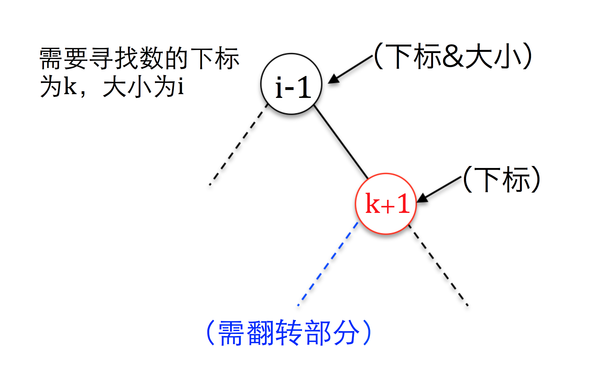

维护一个序列，第$i$次操作时寻找第i小的数的所在位置$Pi$,并将(Pi-1,Pi]的区间翻转。

如果有相同的数，必须保证排序后它们的相对位置关系与初始时相同。

## 链接

[P3165 [CQOI2014]排序机械臂](https://www.luogu.org/problemnew/show/P3165)

## 题解

这道题的大意是区间寻找，区间翻转，所以我们可以用Splay来做，维护一个size值和区间翻转的lazy标记。虽然我前几天还说再也不用Splay了（逃。

注意到每次操作都会使第i个数排序完成，所以我们每次的Pi-1事实上就是数组下标的i-1。
- - - 
对于区间的寻找，我们注意到可以在开始的时候就记录下来第i小的数的位置，也就是把他们的指针存在一个数组里面。



然后在查询的时候，先把第i-1大的树splay到根；找到第i小的数对应的节点指针，寻找其在排序二叉树中的后继节点（图中红色节点），然后把后继splay到根的右子树。

但注意在实际查找中，因为寻找后继会破坏根结点，所以要先找到后继节点，然后再完成上述操作。

然后关于位置，我们可以看出，根节点左边（包括根结点），也就是图中的绿色部分应当有i-1个数，而其他在i左边（包括i）的数应该就是图中的蓝色部分，所以只要将蓝色部分的size加上一个i-1就是每一次操作的结果
- - - 
翻转就是常规的区间翻转，打标记pushdown什么的。
- - - 
为了方便满足一些它的要求，我还事先做了离散化的处理。（其实并没有什么用

另外还有就是我写的时候还因为少push_down了几次被坑了一下。不过最后一次过评测还是蛮开心的。

## 代码
代码写的有点丑，主要是比较懒的缘故吧。
```cpp
#include <cstdio>
#include <algorithm>
using namespace std;

struct wupin{
    int id,h;
}w[100100];

struct splay_t{
    struct node_t{
        int val,size;
        bool rev;
        node_t *p,*son[2],**root,**null;
        inline bool get_p(){return p->son[1] == this;}
        inline void init(node_t **root,node_t **null){this->null = null,this->root = root;}
        inline int lsize(){return son[0]->size;} inline int rsize(){return son[1]->size;}
        inline void update(){size = lsize()+rsize()+1;}
        inline void link(node_t *dst,int tmp){
            dst->son[tmp] = this;
            this->p = dst;
        }
        inline void push_down(){
            if(this == *null) return;
            if(rev){
                swap(son[0],son[1]);
                son[0]->rev^=1,son[1]->rev^=1;
                rev = 0;
            }
        }
        inline void rotate(){
            p->push_down(),push_down();
            node_t *rp = p;bool re = get_p();
            link(rp->p,rp->get_p());
            son[1-re]->link(rp,re);
            rp->link(this,1-re);
            rp->update(),update();
            if(p == *null) *root = this;
        }
        inline node_t* splay(node_t *tar = NULL){
            if(tar == NULL) tar = *null;
            p->push_down(),push_down();
            while(p!=tar){
                if(p->p == tar)
                    rotate();
                else if(p->get_p() == get_p())
                    p->rotate(),rotate();
                else
                    rotate(),rotate();
            }
            return this;
        }
        inline node_t *upper(){
            splay();
            node_t *r = son[1];
            while(true){
                r->push_down();
                if(r->son[0] == *null) break;
                r = r->son[0];
            }
            return r;
        }
    };
    int cnt;
    node_t pool[110000],*to[110000],*null,*root;
    splay_t(){
        cnt = 0;
        null = newnode();
        null->size = 0;
    }
    node_t *newnode(int val = 0){
        node_t *r = &pool[cnt++];
        r->init(&root,&null);
        r->val = val,r->size = 1,r->rev = 0;
        r->p = r->son[0] = r->son[1] = null;
        return r;
    }
    node_t* build(wupin *a,int l,int r){
        if(l>r) return null;
        int mid = (l+r)>>1;
        node_t *ret = newnode(a[mid].h);
        to[a[mid].h] = ret;
        build(a,l,mid-1)->link(ret,0);
        build(a,mid+1,r)->link(ret,1);
        ret->update();
        return ret;
    }
};

splay_t s;

int n;

bool cmp1(wupin a,wupin b){return a.id<b.id;}
bool cmp2(wupin a,wupin b){
    if(a.h!=b.h) return a.h<b.h;
    else         return a.id<b.id;
}

void find(){
    for(int i = 1;i<=n;i++){
        //找到应操作节点的后继
        splay_t::node_t *rbound = s.to[i]->upper();
        //把前面归位好的最后一个节点旋到根节点
        s.to[i-1]->splay();
        //把后继旋转到根节点的右儿子
        rbound->splay(s.to[i-1]);
        //打印位置
        printf("%d ",i + rbound->lsize()-1);
        //添加lazy标记
        rbound->son[0]->rev^=1;
    }
}

int main(){
    scanf("%d",&n);
    for(int i = 1;i<=n;i++){
        scanf("%d",&w[i].h);
        w[i].id = i;
    }
    //预处理
    sort(w+1,w+n+1,cmp2);
    for(int i = 1;i<=n;i++)
        w[i].h = i;
    sort(w+1,w+n+1,cmp1);
    w[0].h = 0;
    w[n+1].h = n+1;
    //正式操作
    s.root = s.build(w,0,n+1);
    find();
    return 0;
}
```